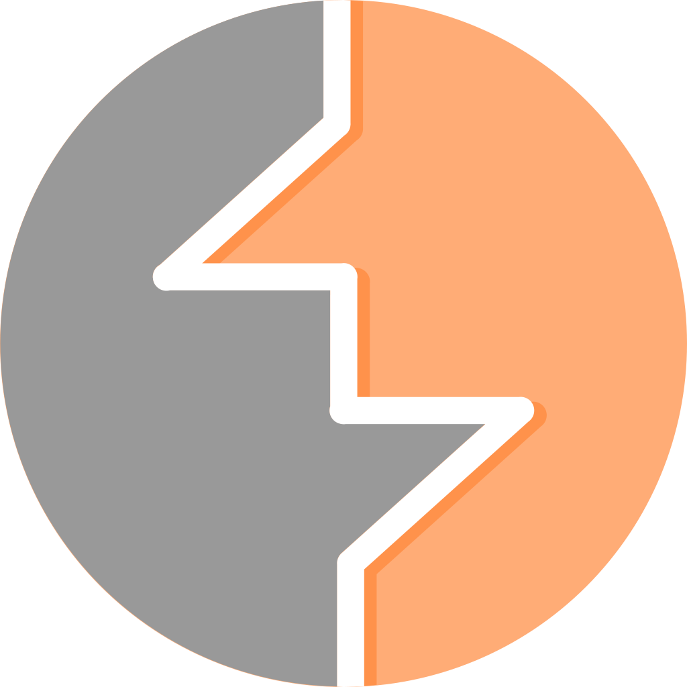
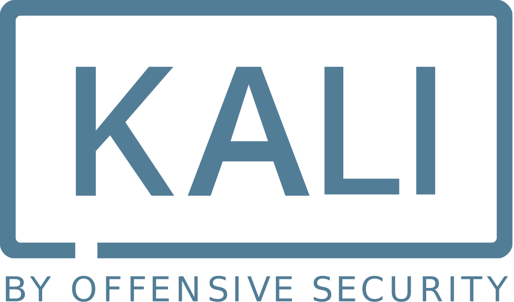
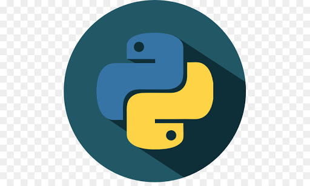
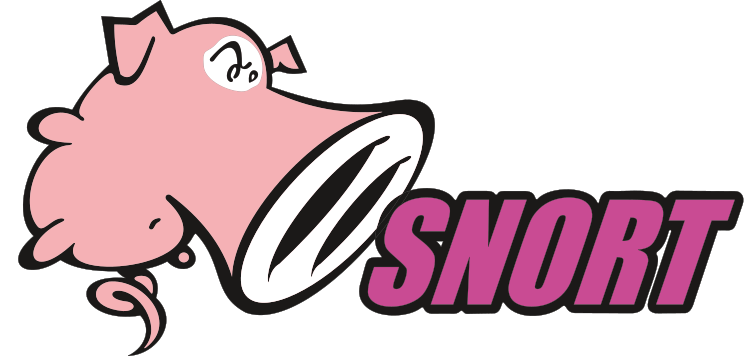
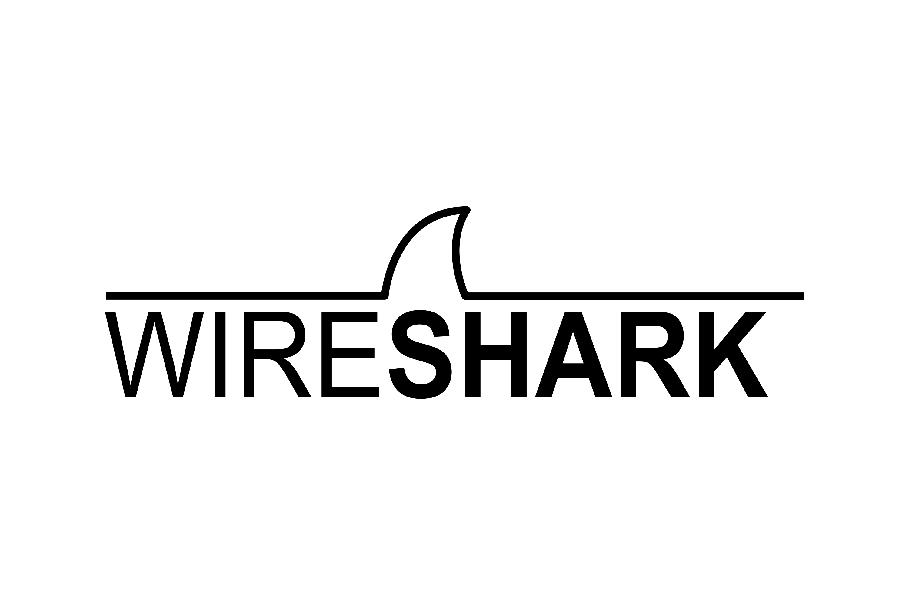

###  👋 there, I'm Olajuwon - aka ✨ D3epDiv3r ✨

## I'm an Ethical Hacking and Cybersecurity Student at Coventry University, Full Stack Web Developer, and a Technological Enthusiast

- 🌱 I’m currently learning everything 🤣
- 👯 I’m looking to collaborate with other like-minded individuals
- ⚡ Fun facts: I love Hacking. I love Coding. I love Computers.

### Spotify Playing 🎧

 

### Some Languages and Tools:

 
